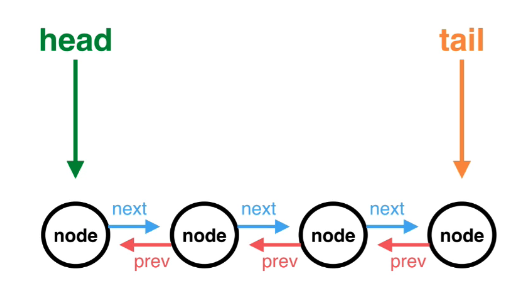

## Linked List

### What is a linked list?

The list of elements, called nodes, that are connected together

- **Single** linked list: each node only has reference to the node after it


- **Doubly** linked list: each node has reference to the node before and after it


### How to make a linked list?

1. The `linkedList` needs to know two nodes in the whole list: *head node* and *tail node*
2. Every nodes should have `value`, `prev` and `next` properties



### What operations should a linked list have?

- addToHead
- addToTail
- removeHead
- removeTail
- search
- indexesOf

### Linked list implementation

```ts
export class LinkedList {
  head: (null | Node) = null
  tail: (null | Node) = null

  addToHead(value: number): void {
    const newNode = new Node(value, null, this.head)
    if (this.head) { // was not empty
      this.head.prev = newNode
      this.head = newNode
    } else { // empty
      this.head = this.tail = newNode
    }
  }
  addToTail(value: number): void {
    const newNode = new Node(value, this.tail, null)
    if (this.tail) {
      this.tail.next = newNode
      this.tail = newNode
    } else {
      this.head = this.tail = newNode
    }
  }
  removeHead(): void {
    if (!this.head) return // empty
    if (!this.head.next) { // only one node
      this.head = this.tail = null
      return
    }
    const newHead = this.head.next
    newHead.prev = null
    this.head = newHead
  }
  removeTail(): void {
    if (!this.tail) return
    if (!this.tail.prev) {
      this.head = this.tail = null
      return
    }
    const newTail = this.tail.prev
    newTail.next = null
    this.tail = newTail
  }
  search(search: number): (null | number) {
    let pointer = this.head
    while (pointer) {
      if (pointer.value === search) return search
      pointer = pointer.next
    }
    return null
  }
  indexesOf(search: number): number[] {
    const matchIndexes = []
    let pointer = this.head
    let index = 0
    while (pointer) {
      if (pointer.value === search) matchIndexes.push(index)
      pointer = pointer.next
      index++
    }
    return matchIndexes
  }
}

export class Node {
  constructor(
    public value: number,
    public prev: (null | Node),
    public next: (null | Node)
  ) {
    this.value = value
    this.prev = prev
    this.next = next
  }
}
```

### Linked list wrap up

Array v.s Linked list

|           | Array | Linked list |
|-----------| :---: | :---------: |
| Reading   | O(1)  | O(n)        |
| Insertion | O(n)  | O(1)        |
| Deletion  | O(n)  | O(1)        |

## Binary Search Tree

### What is a binary search tree?

Binary search tree, BST, is a collection of nodes that are connected together in a certain way. Each node in a BST will have up to 2 child nodes, left node and right node

### How to make a binary search tree?

All of the left node will be the *less or equal* value to their parent node and all of the right node will be the *greater* value than their parent node


### What operations should a binary search tree have?

- inserts
- contains
- depthFirstTraversal: start at the top, and follow each branch all the way down to its bottom
  - In-order version: from least to greatest
  - Reverse In-order: from greatest to least
  - Pre-order version: Parent node -> left child node -> right child node. This order is useful when we try to make a copy of the tree
  - Post-order version: left children -> right children -> Parent node. This can be useful to safely delete nodes from a binary search tree
- breadthFirstTraversal: start at the top, but we will across each level before moving down to the next level. This is useful to define a hierarchy or a level of command.
- getMinValue
- getMaxValue

### BST implementation

```ts
export class BST {
  left: (BST | null) = null
  right: (BST | null) = null
  constructor(public value: number) {
    this.value = value
    this.left = null
    this.right = null
  }
  insert(value: number): void {
    if (value <= this.value) {
      if (!this.left) this.left = new BST(value)
      else this.left.insert(value)
    } else {
      if (!this.right) this.right = new BST(value)
      else this.right.insert(value)
    }
  }
  contains(value: number): boolean {
    if (value === this.value) return true
    if (value < this.value) {
      if (!this.left) return false
      return this.left.contains(value)
    }
    if (!this.right) return false
    return this.right.contains(value)
  }
  // in-order: from least to greatest, left -> node -> right
  depthFirstTraversalInOrder(iteratorFunction: (value: number) => any): void {
    if (this.left) this.left.depthFirstTraversalInOrder(iteratorFunction)
    if (this.value) iteratorFunction(this.value)
    if (this.right) this.right.depthFirstTraversalInOrder(iteratorFunction)
  }
  // reverse-in-order: from greatest to least, right -> node -> left
  depthFirstTraversalReverseInOrder(iteratorFunction: (value: number) => any): void {
    if (this.right) this.right.depthFirstTraversalReverseInOrder(iteratorFunction)
    if (this.value) iteratorFunction(this.value)
    if (this.left) this.left.depthFirstTraversalReverseInOrder(iteratorFunction)
  }
  // pre-order: display node -> left -> right
  depthFirstTraversalPreOrder(iteratorFunction: (value: number) => any): void {
    if (this.value) iteratorFunction(this.value)
    if (this.left) this.left.depthFirstTraversalPreOrder(iteratorFunction)
    if (this.right) this.right.depthFirstTraversalPreOrder(iteratorFunction)
  }
  // post-order: display node -> left -> right
  depthFirstTraversalPostOrder(iteratorFunction: (value: number) => any): void {
    if (this.left) this.left.depthFirstTraversalPostOrder(iteratorFunction)
    if (this.right) this.right.depthFirstTraversalPostOrder(iteratorFunction)
    if (this.value) iteratorFunction(this.value)
  }
  breadthFirstTraversal(iteratorFunction: (value: number) => any): void {
    const queue: BST[] = [this]
    while (queue.length) {
      const executable = queue.shift()! // Non-Null assertion operator: !
      iteratorFunction(executable.value)
      if (executable.left) queue.push(executable.left)
      if (executable.right) queue.push(executable.right)
    }
  }
  getMinValue(): number {
    if (!this.left) return this.value
    return this.left.getMinValue()
  }
  getMaxValue(): number {
    if (!this.right) return this.value
    return this.right.getMaxValue()
  }
}
```

### BST wrap up

Binary Search Tree is used very often to store data because they are very fast to *search* through and *retrieve* data from. In fact, it is also very quick to *insert* and *delete* data from BST.

One import thing to know is that Binary Search Tree has the most performance when they are **balanced**.

## Hash Table

### What is a hash table?

Hash tables are used to store data that is in the form of a key associated with a value.

### How to make a hash table?

A hash table is simply a table of a *predetermined* length where each of the cells of the bucket holds a piece of data which has a key-value pair.

We'll use `array` as our hash table and each index of the array will be a bucket.


### What operations should a hash table have?

- length
- hash
- upsert
- get
- retrieveAll

### Hash table implementation

```ts
export class HashTable {
  buckets: HashNode[] = []
  constructor(public size: number) {
    this.buckets = Array(size)
  }
  length(): number {
    return this.buckets.length
  }
  hash(key: string): number {
    let value = 0
    for (const character of key.split('')) {
      value += character.charCodeAt(0)
    }
    return value % this.length()
  }
  upsert(key: string, value: any): void {
    const index = this.hash(key)
    let current: (HashNode | null) = this.buckets[index]
    if (!current) this.buckets[index] = new HashNode(key, value, null)
    else {
      if (current.key === key) {
        current.value = value
        return
      }
      while (current.next) {
        current = this.buckets[index].next as HashNode
        if (current.key === key) {
          current.value = value
          return
        }
      }
      current.next = new HashNode(key, value, null)
    }
  }
  get(key: string): any {
    const index = this.hash(key)
    let current: (HashNode | null) = this.buckets[index]
    if (!current) return null
    while (current) {
      if (current.key === key) return current.value
      current = current.next
    }
    return null
  }
  retrieveAll() {
    const nodes = []
    for (let index = 0; index < this.length(); index++) {
      let currentNode = this.buckets[index] as (HashNode | null)
      while (currentNode) {
        nodes.push(currentNode)
        currentNode = currentNode.next
      }
    }
    return nodes
  }
}

export class HashNode {
  constructor(
    public key: string,
    public value: any,
    public next: (HashNode | null)
  ) {
    this.key = key
    this.value = value
    this.next = next || null
  }
}
```

### Hash table wrap up

- Pros:
  - Constant time lookup: O(1)
  - Constant time insertion: O(1)
- Cons: Data doesn't store  references to other pieces of data in the data structure, like linked list and binary search tree do

Practical use cases

- Email provider storing addresses
- Users of an application
